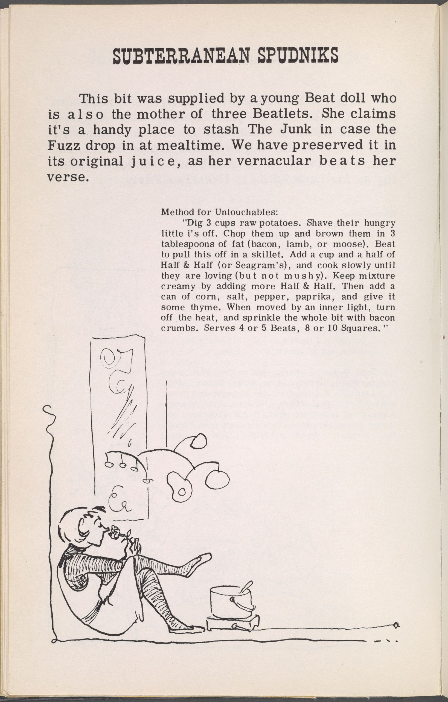

That one time there was a picture in a book. 

Now, each topic is rendered as its own HTML section with the title, link, and the topic's HTML content. If there are no topics, the bundle itself is rendered similarly. This removes any list structure and outputs full HTML for each topic as requested.

